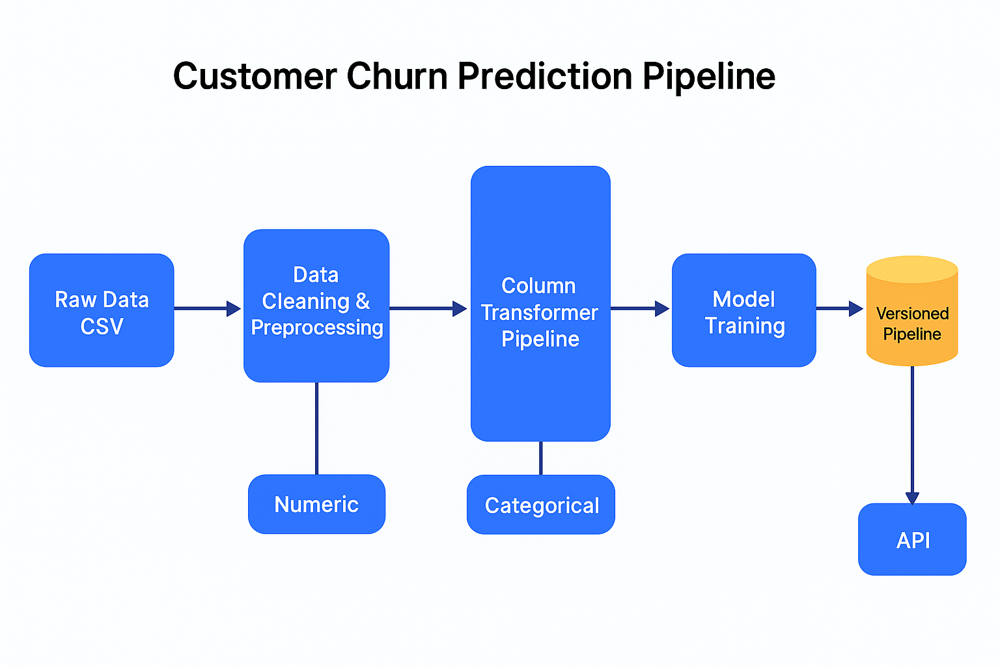

# Customer Churn Prediction 


---

##  Project Overview

This repository implements a **full-stack Machine Learning solution** to predict **customer churn** in a telecom company. It demonstrates **production-level ML engineering skills**, including:

- Data preprocessing, cleaning, and feature engineering  
- Column-specific transformations for numeric & categorical data  
- Random Forest Classifier model with **versioned pipelines**  
- Real-time predictions via **FastAPI REST API**  
- Dockerization for reproducible deployment  
- Cloud deployment-ready for **Render / Railway**  
- Automated **model versioning & manifest tracking**



---

## 📂 Repository Structure

```text
customer-churn-prediction/
│
├── data/
│   └── raw/
│       └── Telco-Customer-Churn.csv
│
├── models/
│   ├── pipeline_v*.pkl        # Trained pipeline versions
│   └── manifest.json          # Model registry
│
├── notebooks/
│   └── 01_eda_and_model.ipynb  # Exploratory Data Analysis
│
├── src/
│   ├── api.py                 # FastAPI API
│   ├── train_pipeline.py      # ML pipeline trainer
│   ├── predict.py             # Local prediction script
│   └── utils.py               # Helper functions
│
├── requirements.txt
├── .gitignore
└── README.md
🔧 Tech Stack
Python 3.11

Pandas / NumPy → Data manipulation & cleaning

Scikit-Learn → Pipeline, preprocessing, Random Forest

FastAPI → REST API

Joblib → Model serialization

Docker → Containerized deployment

Render / Railway → Cloud hosting

🧩 Features & Highlights
Automated Preprocessing:
Numeric scaling, missing value imputation, one-hot encoding

Versioned Pipelines:
Timestamped models with manifest tracking for reproducibility

Real-time Prediction API:
JSON input → churn prediction + probability

Docker & Deployment Ready:
Easy deployment in Render/Railway without retraining

Scalable & Extendable:
Pipeline can incorporate more features or different ML models

🧠 Model Pipeline Diagram
mermaid
Copiar código
flowchart LR
    A[Raw Data CSV] --> B[Data Cleaning & Preprocessing]
    B --> C[Numeric / Categorical Split]
    C --> D[ColumnTransformer Pipeline]
    D --> E[RandomForestClassifier Training]
    E --> F[Versioned Pipeline Saved as .pkl]
    F --> G[Manifest.json Updated]
    G --> H[FastAPI / Deployment]
🚀 Quick Start (Local)
Clone the repository

bash
Copiar código
git clone https://github.com/<your-username>/customer-churn-prediction.git
cd customer-churn-prediction
Setup virtual environment

bash
Copiar código
python -m venv .venv
source .venv/bin/activate  # Linux/macOS
.venv\Scripts\activate     # Windows
Install dependencies

bash
Copiar código
pip install -r requirements.txt
Train the ML pipeline locally

bash
Copiar código
python -m src.train_pipeline
Test local prediction

bash
Copiar código
python -m src.predict
Run FastAPI

bash
Copiar código
uvicorn src.api:app --reload
Access Swagger UI: http://127.0.0.1:8000/docs

🧪 API Usage Example
POST /predict
Content-Type: application/json

json
Copiar código
{
  "gender": "Male",
  "SeniorCitizen": 0,
  "Partner": "Yes",
  "Dependents": "No",
  "tenure": 12,
  "InternetService": "Fiber optic",
  "Contract": "Month-to-month",
  "PhoneService": "Yes",
  "MultipleLines": "No",
  "OnlineSecurity": "No",
  "OnlineBackup": "Yes",
  "DeviceProtection": "Yes",
  "TechSupport": "No",
  "StreamingTV": "Yes",
  "StreamingMovies": "No",
  "PaperlessBilling": "Yes",
  "PaymentMethod": "Electronic check",
  "MonthlyCharges": 75.5,
  "TotalCharges": 350.4
}
Response

json
Copiar código
{
  "churn": 1,
  "probability": 0.785
}
🐳 Docker Deployment
Build image

bash
Copiar código
docker build -t churn-api .
Run container

bash
Copiar código
docker run -p 8000:8000 churn-api
Access API
http://localhost:8000/docs

☁️ Cloud Deployment (Render)
Create account at Render

Connect GitHub repo → New → Web Service

Build command:

bash
Copiar código
pip install -r requirements.txt
Start command:

bash
Copiar código
uvicorn src.api:app --host 0.0.0.0 --port 8000
Access /docs to test the API live.

💡 Tip: Commit pre-trained models in models/ to skip retraining on deploy.

📈 Performance Metrics
Metric	Score
Accuracy	0.71
F1-score (Churn=Yes)	0.52

RandomForestClassifier handles numeric and categorical features automatically

Versioned pipelines allow for model rollback or A/B testing

💡 Next Steps
Hyperparameter tuning (GridSearch / Optuna)

Experiment with XGBoost / LightGBM for better F1-score

Add CI/CD workflow (GitHub Actions) for automatic retraining & deploy

Add unit tests for API validation and pipeline integrity

📄 License
MIT License – Free to use, modify, and distribute.